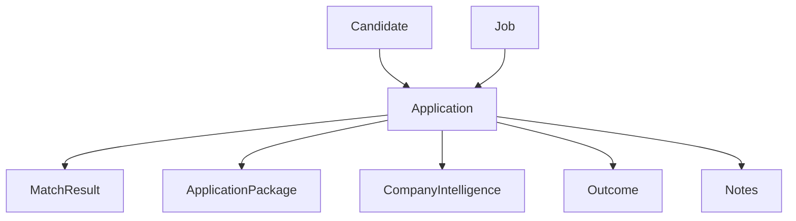

# Architecture Review after v0.8.0

Copyright 2026 AI-Career-OS contributors

Licensed under the Apache License, Version 2.0.

## Executive summary

AI-Career-OS has reached a coherent end-to-end MVP by v0.8.0:

```text
job ingestion -> matching -> application package -> company intelligence -> outcomes -> application domain model
```

The architecture is intentionally simple and readable. FastAPI, Pydantic models, deterministic domain functions, PostgreSQL, and direct `psycopg` repository functions have kept the project easy to inspect and safe for rapid sprint work.

The main architecture risk is that the MVP is now crossing from feature discovery into product foundation. Several modules are carrying multiple responsibilities, persistence is partially normalized, and API responses are not yet standardized. Before adding another product feature sprint, the project should harden its structure, database evolution process, and API contract.

Recommended next sprint: **D. Sprint 9: Architecture Hardening**.

## Repository assessment

### Backend architecture

Current backend shape:

- `backend/app/main.py` owns FastAPI setup, request models, route handlers, orchestration, and error translation.
- `backend/app/models.py` contains shared domain models.
- `backend/app/repositories.py` contains PostgreSQL access functions.
- Domain modules provide deterministic behavior for ingestion, matching, application packages, company intelligence, feedback, and notes.
- `database/schema.sql` is the canonical schema definition.

Strengths:

- Clear MVP layering: API routes call deterministic services and repository functions.
- No hidden AI, scraping, paid API, browser automation, or credential-based automation dependency.
- Direct SQL through `psycopg` keeps behavior inspectable.
- Application is now the central business object after Sprint 8.
- CI compiles backend code and runs tests.

Concerns:

- `main.py` is becoming a route, schema, orchestration, and error handling hub.
- `repositories.py` is becoming a broad data access module for every aggregate.
- The database has grown beyond a single `schema.sql` file being comfortable as the only evolution mechanism.
- Several generated artifacts have API models but no first-class persisted tables yet.
- The API surface is useful but not yet versioned or response-model consistent.

### Domain model

Current core entities:

- Candidate
- Application
- Job
- MatchResult
- ApplicationPackage
- CompanyIntelligence
- Outcome
- Notes

The Sprint 8 Application entity is the right architectural center. It creates a stable object that can connect the candidate, job, match, package, intelligence, outcomes, and notes.

Current domain shape:



Findings:

- Application status and Outcome overlap. Status is current state; Outcome is event history. That distinction should be made explicit.
- `candidate_id` and `job_id` on outcomes are useful for querying but duplicate data available through application linkage.
- Application has IDs for package and intelligence artifacts, but those artifacts are not yet backed by normalized tables.
- Job source metadata exists, but source handling is still mostly free text.
- Candidate profile remains flexible JSON. That is suitable for MVP, but future reporting will require either extracted fields or structured sub-entities.

Missing entities to consider:

- `application_packages`
- `company_intelligence_reports`
- `application_status_events`
- `recommendations`
- `recommendation_usage`
- `companies`
- `recruiter_contacts`
- `generated_documents`
- `users` or `workspaces`
- `audit_events`

### API structure

Current API categories:

- Demo endpoints
- Candidate and job persistence
- Job ingestion
- Matching and persisted matches
- Interview briefings
- Application package generation
- Company intelligence generation
- Application domain endpoints
- Outcomes and insights

Strengths:

- Endpoint names are mostly understandable.
- The API follows the current sprint evolution closely.
- The Application endpoints added in Sprint 8 establish a better product-oriented center.

Concerns:

- No API version prefix exists yet.
- Response envelopes differ by endpoint.
- Many route handlers return dictionaries directly rather than explicit response models.
- List endpoints do not yet support pagination, filtering, or sorting.
- Error responses are serviceable for MVP but not yet standardized as an API contract.
- Some endpoint names reflect implementation history rather than final domain language, such as `/matches/persist` and `/briefings/persist`.

Recommended direction:

- Introduce `/v1` before public or long-lived client use.
- Define explicit response models for every endpoint.
- Standardize error responses.
- Gradually move routes into domain routers:
  - `candidates`
  - `jobs`
  - `applications`
  - `matching`
  - `intelligence`
  - `outcomes`

### Database schema

Current tables:

- `candidate_profiles`
- `job_descriptions`
- `match_results`
- `interview_briefings`
- `applications`
- `application_notes`
- `application_outcomes`

Strengths:

- PostgreSQL schema is readable and compact.
- Foreign keys exist for core candidate/job/application relationships.
- Useful basic indexes exist for jobs, matches, applications, notes, and outcomes.
- Application is linked to candidate and job, which supports a proper pipeline model.

Concerns:

- No migrations framework exists yet.
- Generated package and intelligence artifacts are referenced but not normalized.
- Match result persistence does not fully capture the richer Sprint 4 scoring explanation model.
- Status history is not modeled separately from current status.
- Reporting queries will need more time-based and status-based indexes.

### Test coverage

Strengths:

- Tests cover deterministic matching, ingestion safety, application packages, company intelligence, feedback, and application repository behavior.
- CI runs compile validation and pytest.
- Tests protect the key guardrails around no scraping, no private data leakage, and deterministic outputs.

Gaps:

- No live PostgreSQL integration test suite.
- Repository tests use fakes for many paths.
- API route tests are limited compared with domain tests.
- No migration validation exists because there is no migration layer.
- No contract tests for consistent error response shapes.

### README and sprint evolution

The README clearly documents the sprint-by-sprint product evolution and includes strong guardrails. It is useful for a reader who wants to understand the MVP.

As the project grows, the README is becoming a combined product overview, architecture document, API guide, and release history. It should eventually be split into:

- `README.md` for quickstart and project overview.
- `docs/api.md` for endpoint examples.
- `docs/architecture.md` for system structure.
- `docs/privacy.md` for data handling rules.
- `docs/roadmap.md` for planned releases.

## Sprint recommendation

Recommendation: **D. Sprint 9: Architecture Hardening**.

Reasoning:

- Sprint 8 created the right central domain object. The next highest leverage move is to stabilize the foundation around it.
- Adding a dashboard, reporting, or recruiter CRM now would increase pressure on an API and schema that still need normalization and contract cleanup.
- Architecture hardening will make future feature sprints faster and less risky.
- The project is still small enough that restructuring routes, repositories, tests, and schema evolution can be done without a painful migration.

Recommended Sprint 9 focus:

- Add migration strategy.
- Split route modules by domain.
- Split repository functions by aggregate.
- Add explicit response models.
- Add standard error response shape.
- Add application status event history.
- Add first-class persistence for application packages and company intelligence.
- Add a small live PostgreSQL integration test path.

## Architecture risks

High priority:

- No authentication or authorization boundary before real user data.
- No schema migration process.
- Status and outcome semantics can drift.
- Free-text notes remain sensitive even with redaction.

Medium priority:

- Route and repository modules are growing too broad.
- API responses are not standardized.
- Generated artifacts are not fully persisted.
- Reporting requirements are not yet modeled.

Lower priority:

- README is becoming too broad.
- Demo data and production-like data paths live close together.
- Source naming should become more controlled.

## Conclusion

The MVP architecture is healthy for its stage. It has strong deterministic boundaries, a clear domain center, and pragmatic persistence. The next milestone should turn the MVP from a sprint-built prototype into a maintainable v1 foundation.
